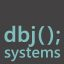
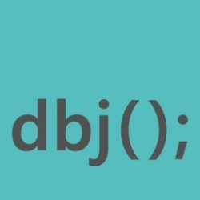

# dbjplusplus
## A Modern & Standard C++ lib 

### Various working and usable Proofs Of Concepts (POC)
### And Foundation Mechanisms (FM)
#### Unless stated otherwise.

Copyright 2017,2018,2019 by dbj@dbj.org

Licensed under the GNU GPL License, Version 3.0 (the "License");
you may not use this file except in compliance with the License.
You may obtain a copy of the License in the file LICENSE enclosed in
this project.

https://www.gnu.org/licenses/gpl-3.0.html

Unless required by applicable law or agreed to in writing, software
distributed under the License is distributed on an "AS IS" BASIS,
WITHOUT WARRANTIES OR CONDITIONS OF ANY KIND, either express or implied.
See the License for the specific language governing permissions and
limitations under the License.

