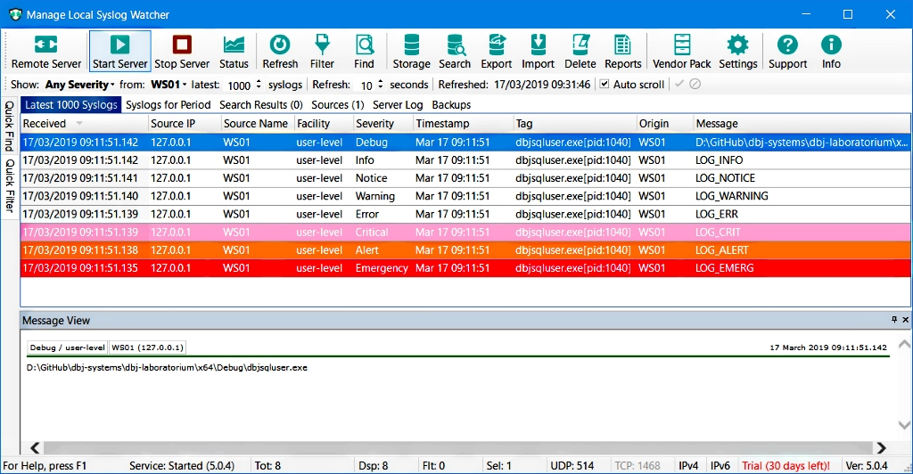

# dbj++log 

**Version: 1.0.0**

### syslog for the rest of us

**Simple, standard C++ compliant, asynchronous, fast, logging library.**

> Disclaimer: <br/>
> This release is Proof Of Concept (POC). <br/>
> Use at your own risk.

*`syslog` [project we started from](https://github.com/asankah/syslog-win32) is Copyright (c) 2008 Secure Endpoints Inc.*
## The API
### Initalization
Start by including the single header file.
```cpp
#include <dbj++log.h>
```
All of the API is standard C++, and it is a rather simple interface to
 the full syslog implementation in the back.
```cpp
using namespace ::dbj::log;
```

The user needs to initialise the logging. If remote server is in use, one must give it's IP address.
```cpp
    // address of the remote syslog server
    // default syslog port is 514
    // we do not need to type it
	init_syslog("192.168.0.202");
```

Default behaviour is to use the local syslog server.

```cpp
// connect to the local syslog server
	init_syslog();
```
This is the preffered syslog setup. Use the local syslog server in a "relay" mode. All the local logger send to it, and you setup the "relay" to send further to the remote  (central)  syslog server.

Next step is optional. But this is how you control the logging behaviour.
```cpp
// sender tag will be "Anonymous"
syslog_open( );
```
First argument is the "tag" aka the "identity".
if nullptr it will appear as "Anonymous", in the log, otherwise give it as a string literal.
```cpp
// sender tag will be application basename
syslog_open( basename(argv[0]));
```
Tag max length is 128. Second argument is to control if user wants to use the local log file. Note: That is not a syslog local server file.
```cpp
// sender tag will be application basename
// every line sent to the syslog server
// will be also written in the local log file.
syslog_open(basename(argv[0]), syslog_open_options::log_perror );
``` 
See the NOTE section bellow on the location and behaviour of this file.

Third argument is syslog "facility" feature. This means the tag of the sending side, software module or device kind. Defult (if not given) is "user".
This enum clearly lists the available facilities.
```cpp
	enum class syslog_open_facilities {
		_null_,
		log_kern = (0 << 3), 	/* kernel messages */
		log_user = (1 << 3), 	/* random user-level messages */
		log_mail = (2 << 3), 	/* mail system */
		log_daemon = (3 << 3), 	/* system daemons */
		log_auth = (4 << 3), 	/* security/authorization messages */
		log_syslog = (5 << 3), 	/* messages generated internally by syslogd */
		log_lpr = (6 << 3), 	/* line printer subsystem */
		log_news = (7 << 3), 	/* network news subsystem */
		log_uucp = (8 << 3), 	/* UUCP subsystem */
		log_cron = (9 << 3) 	/* clock daemon */
	};
```
That is a standard syslog protocol nomenclature. Albeit deliberately limited, to make it simple to use.
```cpp
// sender tag will be application basename
// every line sent to the syslog server
// will be also written in the local log file.
// 'facility' is a 'kernel messages'
syslog_open(basename(argv[0]), 
            syslog_open_options::log_perror,
            syslog_open_facilities::log_kern );
``` 
Please remember the `syslog_open()` call is optional. The actuall logging is rather simple and nothing unusual.

```cpp
/* 
standard loging since 1983
2019 from C++
*/
	syslog_emergency("%s", "LOG_EMERG"	);
	syslog_alert("%s", "LOG_ALERT"	);
	syslog_critical("%s", "LOG_CRIT"	);
	syslog_error("%s", "LOG_ERR"		);
	syslog_warning("%s", "LOG_WARNING" );
	syslog_notice("%s", "LOG_NOTICE"	);
	syslog_info("%s", "LOG_INFO"	);
	syslog_debug("%s", argv[0]		);
```
Interface is identical to the `printf()`. 
#### Max log message size is 1024
The total `datagramm` 
(aka message), size is 1KB. This includes the standard syslog header.

Here is the output of the above on a local syslog server/manager

[](https://syslogwatcher.com "syslogwatcher")  

### Async behaviour and Multi Threading

This is all asynchronous as much as windows sockets are asynchronous.
Also, all the important functions in here are capable of sequential working, 
in the presence of multiple threads.
### Notes
Inside this library `stderr` output is redirected to the local log file.
In case you do not need or want that, please ammend the simple code doing it.
Folder and file are under `%programdata%`. Names are currently:

```cpp
/* dbj_util.h */
static char const * DBJ_LOG_FILE_FOLDER = "dbj\\dbj++";
static char const * DBJ_LOG_FILE_NAME = "dbj++.log";
```

Local log file is re-created each time application starts. 
In the (very near) future log file name will equal the application basename, and will be alllowed to grow untill user defined size. 
It will not be re-created each time application starts.

In the (yes, very near) future, we will provide config file functionality where users will be controlling this (and more) externaly.


**WARNING: Messages are composed following the RFC3164**

Currently [RFC3164](https://tools.ietf.org/html/rfc3164) is foollowed. Plan is to develop a support for the newer one: RFC5424.

Make sure you syslog server can understand RFC3164. But, this is the case with almost all of them. 
This is simply because there are milions of devices in use (and will be for a long time to come) who are emitting 
syslog messages in the RFC3164 format. Devices on the network, not PC's or laptops.

> This is a static library. 

> Built with Microsoft (R) C/C++ Optimizing Compiler Version 19.15.26732.1 or better.

> (In 2019Q1, standard C++ was C++17)


-------------------------------------

<pre>
Copyright 2017,2018, 2019 by dbj@dbj.org, dbj.org, dbj.systems ltd.

Licensed under the GNU GPL License, Version 3.0 (the "License");
you may not use any of files in this project except in compliance with the License.
You may obtain a copy of the License in the file LICENSE enclosed in
this project.

https://www.gnu.org/licenses/gpl-3.0.html

Unless required by applicable law or agreed to in writing, software
distributed under the License is distributed on an "AS IS" BASIS,
WITHOUT WARRANTIES OR CONDITIONS OF ANY KIND, either express or implied.
See the License for the specific language governing permissions and
limitations under the License.
</pre>
---------------------------------------------------------------------  

[](http://www.dbj.org "dbj")  

